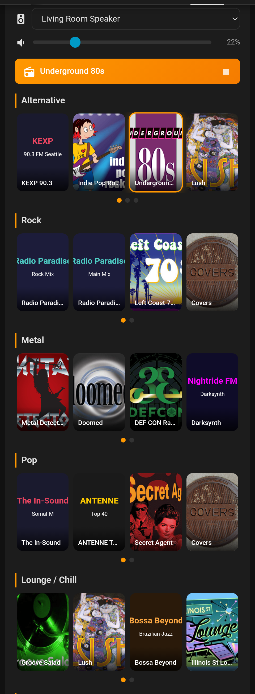

# Internet Radio Jukebox

A custom Lovelace card for Home Assistant that turns your media players into an internet radio jukebox. Works out of the box with zero configuration — just add the card and start listening.

## Features

- **Zero-config** — add the card and it works immediately with 104 built-in stations
- **Visual card editor** — manage everything through the UI, no YAML needed
- **Station explorer** — search and browse thousands of stations via Radio Browser
- **Auto-discovers speakers** — finds all media players with play-media support
- **Cast device artwork** — pushes station logos to Chromecast, Nest Hub, and other Cast devices
- **Smart speaker selection** — auto-selects the currently playing speaker on new browsers
- **12 built-in genres** — Alternative, Rock, Metal, Pop, Lounge/Chill, Sleep, House, Tech House, 80s, Polish, Italian, French
- **Dark and light theme support**
- **Now-playing banner** with stop button
- **Per-category grids** with horizontal scroll and pagination dots
- **Volume control** with per-device volume for multi-speaker setups

## Installation

### HACS (Recommended)

1. Open HACS in Home Assistant
2. Go to **Frontend** → three-dot menu → **Custom repositories**
3. Add `https://github.com/philrenda/jukebox-card` as a **Dashboard** repository
4. Click **Install**
5. Restart Home Assistant

### Manual

1. Download `jukebox-card.js` from the [latest release](https://github.com/philrenda/jukebox-card/releases)
2. Copy it to `/config/www/jukebox-card.js`
3. Add the resource in **Settings → Dashboards → Resources**:
   - URL: `/local/jukebox-card.js`
   - Type: JavaScript Module

## Quick Start

1. Edit your dashboard and click **+ Add Card**
2. Search for **Internet Radio Jukebox**
3. Click any station tile to start playing on the selected speaker

That's it! The card auto-discovers your speakers and comes loaded with 104 stations across 12 genres.

## Configuration (Visual Editor)

Everything is configured through the card's built-in visual editor — no YAML required.

### General Tab

- **Columns** — number of station tiles per row (1–8, default 4)
- **Tile Height** — height of each station tile in pixels (40–300, default 120)
- **Speaker Mode** — choose between:
  - **Auto-discover** — automatically finds all media players that support play-media
  - **Manual** — define a specific list of speakers (see below)

### Adding Speakers (Manual Mode)

1. In the **General** tab, switch speaker mode to **Manual**
2. Click **+ Add Speaker**
3. Enter a display name and select a `media_player` entity from the dropdown
4. Use the arrow buttons to reorder speakers
5. The first speaker in the list is the default selection

### Managing Categories

In the **Stations** tab, each genre is a collapsible category:

- **Rename** — click the ✎ pencil icon next to the category name (or double-click the name)
- **Reorder** — use the ▲ ▼ arrow buttons to move categories up or down
- **Delete** — click the × button to remove a category
- **Add** — click **+ Add Category** at the bottom to create a new category

### Adding Stations

Expand a category and click **+ Add Station** to open the station panel with three options:

**Explore** — Search thousands of internet radio stations by name. Results show the station's country, genre tags, bitrate, and codec. Click the ▶ button to preview, then click **+** to add.

**Browse Defaults** — Browse the 104 built-in stations organized by genre. Stations already in your category show a ✓ checkmark.

**Manual** — Enter a station name, stream URL, and optional logo URL to add any station.

### Resetting to Defaults

If you've customized your stations and want to start over, click **Reset to Defaults** at the bottom of the Stations tab.

## How It Works

- **Speaker persistence** — your selected speaker is saved per-browser via localStorage
- **Active speaker detection** — on a new browser with no saved preference, the card auto-selects whichever speaker is currently playing (prefers speaker groups over individual devices)
- **Cast artwork** — station logos are sent to Cast devices (Nest Hub, Chromecast, etc.) as signed URLs, so artwork displays correctly even through Nabu Casa remote access
- **Now-playing helper** — the card creates an `input_text.jukebox_now_playing` helper to track the current station across devices

## License

MIT
